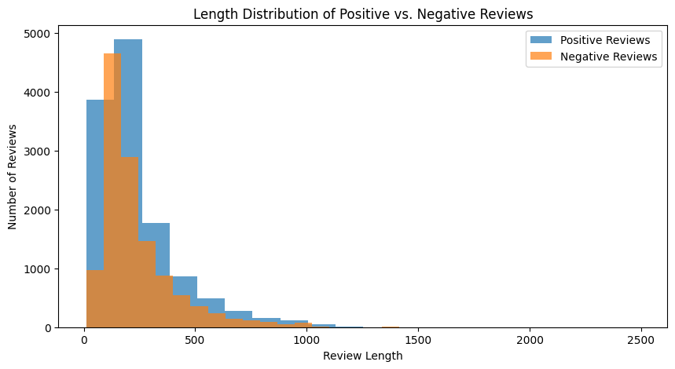
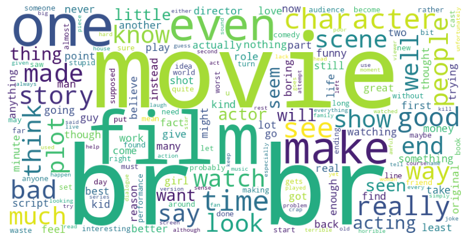
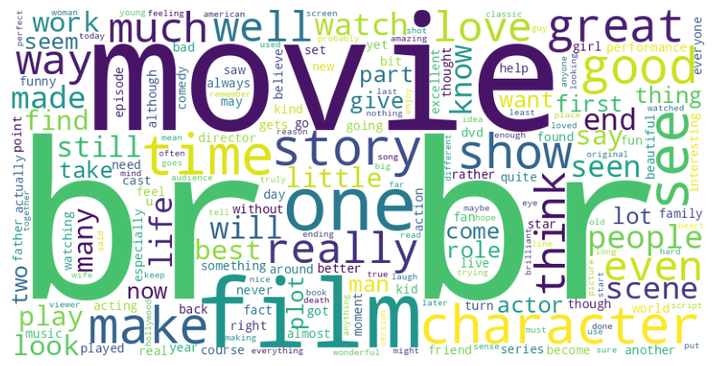
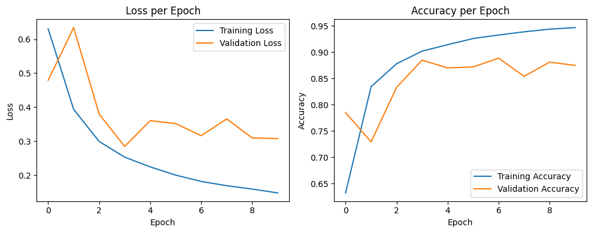
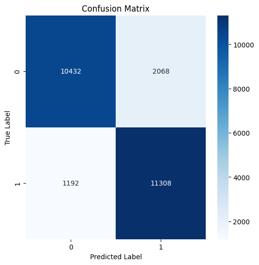

## Sentiment Analysis of IMDB Reviews Using LSTM

#### Welcome! This is a sentiment analysis project on IMDB movie reviews using a Long Short-Term Memory (LSTM) neural network. This project aims to provide a comprehensive exploration of using deep learning techniques to understand and analyze sentiments expressed in movie reviews. The Jupyter Notebook has a detailed implementation of the LSTM model, including data loading, preprocessing, model building, training, and evaluation.

## Goals of This Project
1. To apply LSTM networks, a type of recurrent neural network, in analyzing textual data.
2. To gain practical experience in processing and visualizing data for natural language processing tasks.
3. To understand the nuances of sentiment analysis in a real-world dataset.

### Dataset
The dataset is provided by the `keras` library and consists of 25,000 training reviews and 25,000 testing reviews. Each review in the dataset is tokenized, and words are replaced with integers representing their relative frequency of occurrence. For instance, the integer "3" might represent the third most frequent word in the dataset.

* This histogram compares the length distribution of positive and negative reviews, offering an understanding of how review length might correlate with sentiment.

### Data Preprocessing
Given the varying lengths of movie reviews, data preprocessing involved padding sequences to ensure each review had a uniform length. This step ensures that the model receives input data of consistent shape.

### Word Cloud for Negative Reviews

* This word cloud represents the most frequent words found in negative reviews from the IMDB dataset, providing a visual representation of common themes and sentiments.

### Word Cloud for Positive Reviews

* This word cloud represents the most frequent words found in positive reviews from the IMDB dataset, providing a visual representation of common themes and sentiments.

### Model Architecture
The neural network model is built using Keras and consists of the following layers:
1. **Embedding Layer**: This layer converts the integer sequences into dense vectors of fixed size. It helps in reducing dimensionality and capturing the semantic meaning of words.
2. **LSTM Layer**: LSTM (Long Short-Term Memory) is a type of Recurrent Neural Network (RNN) layer. It's particularly suited for sequence data, like our movie reviews, as it can capture long-term dependencies and patterns in the data.
3. **Dense Layer**: A fully connected layer with a sigmoid activation function. It outputs a value between 0 and 1, representing the predicted sentiment of the review (0 for negative and 1 for positive).

## Results
After training the model for ten epochs, it achieved an accuracy of 87% on the test set. Sample predictions on test data showcased the model's ability to categorize movie reviews effectively.

* This plot shows the training and validation loss and accuracy for each epoch during the model training process, giving insight into the learning efficiency and model convergence.

* The confusion matrix visualizes the performance of the sentiment analysis model, showing the breakdown of true positive, false positive, true negative, and false negative predictions.

## Conclusion and Future Work
This project serves as an introduction to sentiment analysis using deep learning. While the achieved accuracy is promising, there's always room for improvement. Future work could involve experimenting with more complex model architectures, fine-tuning hyperparameters, or using pre-trained word embeddings like Word2Vec or GloVe.
